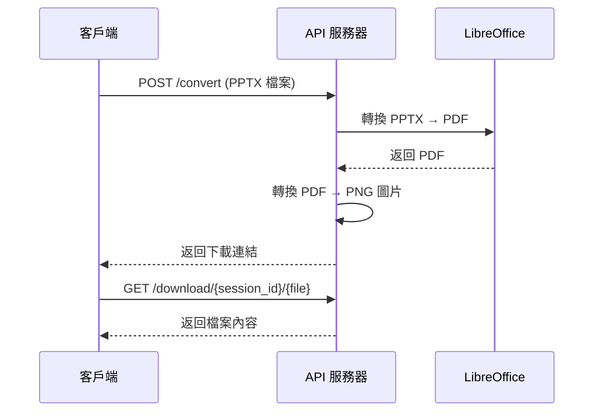

# PPTX 轉換器 API 使用指南

## 概述

PPTX 轉換器 API 是一個基於 Docker 的服務，可以將 PowerPoint (.pptx) 檔案轉換為 PDF 和圖片格式。

## 基本資訊

- **服務地址**: `http://localhost:5000`
- **支援格式**: `.pptx` → `PDF` + `PNG 圖片`
- **最大檔案大小**: 500MB
- **自動清理時間**: 20 分鐘

## API 端點

### 1. 健康檢查

檢查 API 服務狀態和 LibreOffice 可用性。

```http
GET /health
```

**回應範例:**
```json
{
    "status": "healthy",
    "libreoffice_available": true,
    "storage_info": {
        "available": true,
        "current_size_gb": 0.5,
        "max_size_gb": 10.0,
        "usage_percentage": 5.0
    },
    "temp_folders": 3,
    "timestamp": "2025-06-22T13:30:00.123456",
    "uptime": "2 hours, 15 minutes"
}
```

### 2. 檔案轉換

上傳 PPTX 檔案並轉換為 PDF 和圖片。

```http
POST /convert
Content-Type: multipart/form-data
```

**請求參數:**
- `file` (必要): PPTX 檔案 (multipart/form-data)
- `include_hidden_slides` (可選): 是否包含隱藏投影片，預設為 `true`
  - `true`: 包含隱藏投影片
  - `false`: 跳過隱藏投影片
- `dpi` (可選): 圖片解析度，預設為 `200`

**cURL 範例:**
```bash
# 基本轉換 (包含隱藏投影片)
curl -X POST \
  -F "file=@your-presentation.pptx" \
  http://localhost:5000/convert

# 跳過隱藏投影片，高解析度
curl -X POST \
  -F "file=@your-presentation.pptx" \
  -F "include_hidden_slides=false" \
  -F "dpi=300" \
  http://localhost:5000/convert
```

**JavaScript 範例:**
```javascript
const formData = new FormData();
formData.append('file', fileInput.files[0]);

const response = await fetch('http://localhost:5000/convert', {
    method: 'POST',
    body: formData
});

const result = await response.json();
```

**成功回應:**
```json
{
    "message": "轉換完成",
    "total_pages": 5,
    "pdf_download_url": "/download/abc123/presentation.pdf",
    "image_download_urls": [
        "/download/abc123/slide_1.png",
        "/download/abc123/slide_2.png",
        "/download/abc123/slide_3.png",
        "/download/abc123/slide_4.png",
        "/download/abc123/slide_5.png"
    ],
    "cleanup_time": "2025-06-22T14:00:00.123456",
    "request_time": "2025-06-22T13:40:00.123456",
    "done_time": "2025-06-22T13:40:15.456789"
}
```

**錯誤回應:**
```json
{
    "error": "錯誤訊息描述",
    "details": "詳細錯誤資訊"
}
```

### 3. 檔案下載

使用轉換回應中的 URL 下載生成的檔案。

```http
GET /download/{session_id}/{filename}
```

**範例:**
```bash
# 下載 PDF
curl -O http://localhost:5000/download/abc123/presentation.pdf

# 下載圖片
curl -O http://localhost:5000/download/abc123/slide_1.png
```

### 4. 儲存資訊

查看當前儲存使用情況。

```http
GET /storage/info
```

**回應範例:**
```json
{
    "total_size_gb": 1.2,
    "max_size_gb": 10.0,
    "usage_percentage": 12.0,
    "temp_folders_count": 8,
    "warning": false,
    "critical": false
}
```

### 5. 清理過期檔案

清理超過 20 分鐘的臨時檔案。

```http
POST /cleanup/old
```

**回應範例:**
```json
{
    "message": "已清理 3 個過期資料夾",
    "total_freed_mb": 45.2
}
```

### 6. 清理所有檔案

清理所有臨時檔案 (謹慎使用)。

```http
POST /cleanup/all
```

**回應範例:**
```json
{
    "message": "已清理所有臨時檔案",
    "total_freed_mb": 125.7
}
```

## 使用流程

### 1. 基本轉換流程



### 2. 完整使用範例 (Python)

```python
import requests
import os

# 1. 檢查服務狀態
health_response = requests.get('http://localhost:5000/health')
if health_response.json()['libreoffice_available']:
    print("✓ LibreOffice 可用")
else:
    print("✗ LibreOffice 不可用")

# 2. 上傳並轉換檔案
with open('presentation.pptx', 'rb') as f:
    files = {'file': f}
    response = requests.post('http://localhost:5000/convert', files=files)

if response.status_code == 200:
    result = response.json()
    print(f"轉換完成！總共 {result['total_pages']} 頁")
    
    # 3. 下載 PDF
    pdf_url = f"http://localhost:5000{result['pdf_download_url']}"
    pdf_response = requests.get(pdf_url)
    with open('output.pdf', 'wb') as f:
        f.write(pdf_response.content)
    
    # 4. 下載圖片
    for i, img_url in enumerate(result['image_download_urls']):
        img_response = requests.get(f"http://localhost:5000{img_url}")
        with open(f'slide_{i+1}.png', 'wb') as f:
            f.write(img_response.content)
            
    print("所有檔案下載完成！")
else:
    print(f"轉換失敗: {response.json()['error']}")
```

### 3. JavaScript/HTML 範例

```html
<!DOCTYPE html>
<html>
<head>
    <title>PPTX 轉換器</title>
</head>
<body>
    <input type="file" id="fileInput" accept=".pptx">
    <button onclick="convertFile()">轉換</button>
    <div id="result"></div>

    <script>
        async function convertFile() {
            const fileInput = document.getElementById('fileInput');
            const file = fileInput.files[0];
            
            if (!file) {
                alert('請選擇檔案');
                return;
            }
            
            const formData = new FormData();
            formData.append('file', file);
            
            try {
                const response = await fetch('http://localhost:5000/convert', {
                    method: 'POST',
                    body: formData
                });
                
                const result = await response.json();
                
                if (response.ok) {
                    displayResult(result);
                } else {
                    alert(`轉換失敗: ${result.error}`);
                }
            } catch (error) {
                alert(`網路錯誤: ${error.message}`);
            }
        }
        
        function displayResult(data) {
            const resultDiv = document.getElementById('result');
            
            let html = `<h3>轉換完成！總共 ${data.total_pages} 頁</h3>`;
            html += `<p><a href="http://localhost:5000${data.pdf_download_url}" download>下載 PDF</a></p>`;
            html += '<p>下載圖片:</p><ul>';
            
            data.image_download_urls.forEach((url, index) => {
                html += `<li><a href="http://localhost:5000${url}" download>第 ${index + 1} 頁</a></li>`;
            });
            
            html += '</ul>';
            resultDiv.innerHTML = html;
        }
    </script>
</body>
</html>
```

## 錯誤代碼

| HTTP 狀態碼 | 錯誤類型 | 說明 |
|-------------|----------|------|
| 400 | Bad Request | 請求格式錯誤或缺少必要參數 |
| 413 | Payload Too Large | 檔案大小超過 500MB 限制 |
| 415 | Unsupported Media Type | 檔案格式不支援 (非 .pptx) |
| 500 | Internal Server Error | 伺服器內部錯誤 |
| 503 | Service Unavailable | LibreOffice 不可用或儲存空間已滿 |

## 注意事項

### 檔案限制
- 僅支援 `.pptx` 格式
- 最大檔案大小: 500MB
- 自動清理時間: 20 分鐘

### 儲存管理
- 總儲存空間限制: 10GB (可設定)
- 當使用量超過 80% 時會顯示警告
- 當使用量超過 95% 時會拒絕新請求

### 性能考量
- 轉換時間取決於簡報大小和複雜度
- 大型檔案可能需要數分鐘處理
- 建議檔案大小控制在 100MB 以內

### CORS 設定
- 預設允許所有來源 (`Access-Control-Allow-Origin: *`)
- 支援跨域請求

## 部署和設定

### Docker 環境變數

```bash
# 基本設定
HOST=0.0.0.0
PORT=5000
DEBUG=false

# 儲存設定
MAX_STORAGE_GB=10
TEMP_FOLDER=/app/temp
UPLOAD_FOLDER=/app/uploads

# 清理設定
DEFAULT_CLEANUP_MINUTES=20
AUTO_CLEANUP_OLD_FILES_HOURS=24

# 轉換設定
DEFAULT_DPI=200
CONVERSION_TIMEOUT_SECONDS=300
```

### 啟動服務

```bash
# 使用 Docker Compose
docker compose up -d

# 或直接使用 Docker
docker run -p 5000:5000 pptx-converter
```

## 常見問題

### Q: 為什麼轉換失敗？
A: 檢查以下項目:
1. 檔案是否為有效的 .pptx 格式
2. LibreOffice 是否可用 (`GET /health`)
3. 儲存空間是否充足
4. 檔案大小是否超過限制

### Q: 檔案什麼時候會被清理？
A: 
- 自動清理: 每個轉換結果會在 20 分鐘後自動清理
- 手動清理: 可使用 `/cleanup/old` 或 `/cleanup/all` 端點

### Q: 如何增加儲存空間？
A: 修改環境變數 `MAX_STORAGE_GB` 並重啟容器

### Q: 支援其他檔案格式嗎？
A: 目前僅支援 .pptx 格式，未來可能會擴展支援其他格式

## 開發和測試

### 測試端點
訪問 `http://localhost:5000` 查看內建的測試頁面，可以進行完整的功能測試。

### 監控
- 使用 `/health` 端點監控服務狀態
- 使用 `/storage/info` 監控儲存使用情況
- Docker 容器日誌包含詳細的操作記錄

---

**版本**: v2.0  
**更新日期**: 2025-06-22  
**維護者**: PPTX Converter Team
